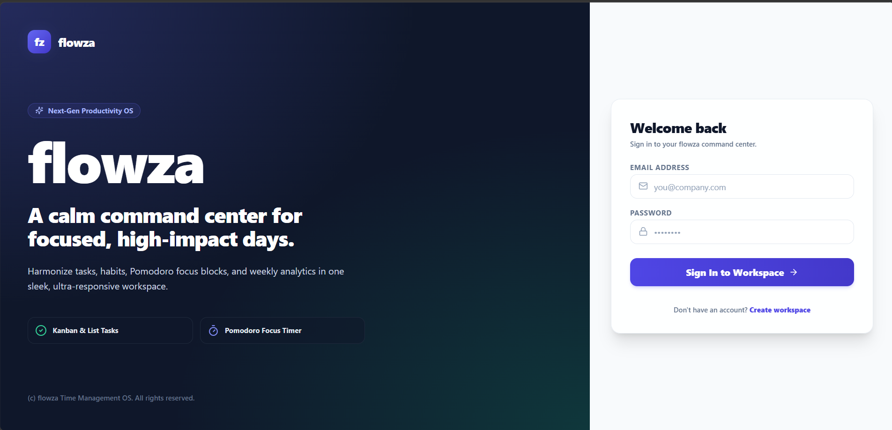
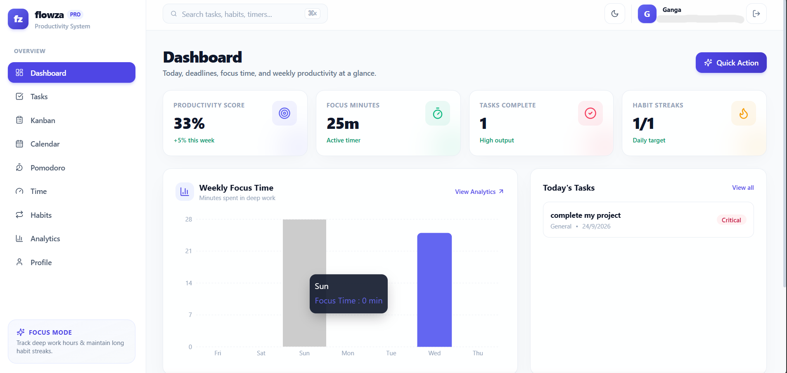
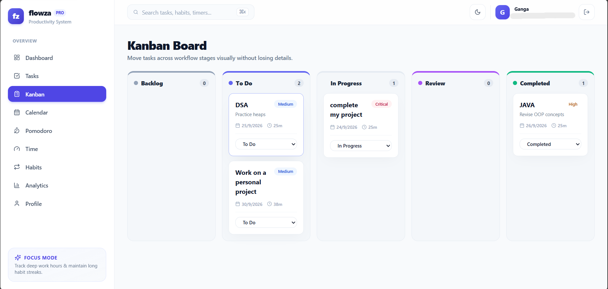
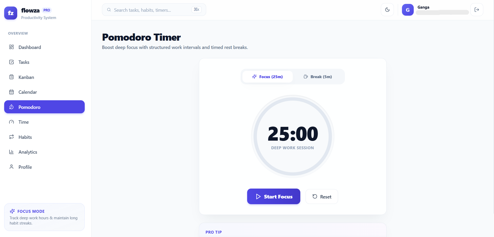

Flowza – Time Management & Productivity Platform

Flowza is a full-stack productivity and time-management web application designed to help users organize tasks, build habits, manage focus sessions, and track productivity.

Live Demo

[Open Flowza](https://flowza-one.vercel.app)

Features

- User registration and login
- Task creation and management
- Kanban-style task organization
- Task updating and deletion
- Habit tracking
- Focus/Pomodoro timer
- Productivity analytics
- Calendar-based organization
- User profile management
- Protected routes and authentication

Tech Stack

Frontend

- React
- Vite
- Redux Toolkit
- Tailwind CSS
- Axios

Backend

- Node.js
- Express.js
- MongoDB
- Mongoose
- JWT Authentication

Deployment

- Vercel – Frontend
- Render – Backend
- MongoDB Atlas – Database

Architecture

Flowza follows a full-stack architecture:

React Frontend → Express/Node.js API → MongoDB Database

The frontend communicates with the backend through REST APIs, while MongoDB Atlas stores application data.

Purpose

Flowza was developed as a full-stack project to apply concepts including:

- Frontend development
- REST API development
- Database integration
- Authentication and authorization
- State management
- CRUD operations
- Cloud deployment

Future Improvements

- Audio notifications when focus sessions or breaks begin and end
- More detailed productivity reports
- Improved calendar integration
- Additional customization options
- Mobile application support

Screenshots

Login

Dashboard

Kanban Board

Pomodoro Timer

